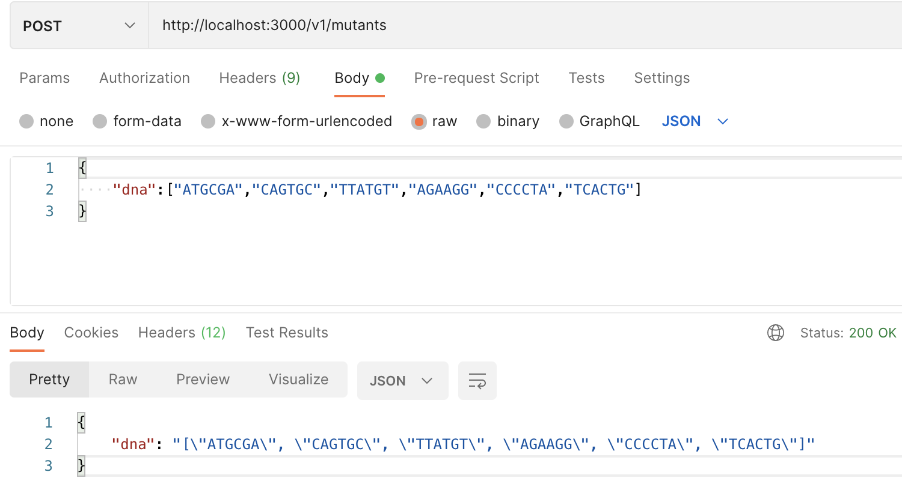
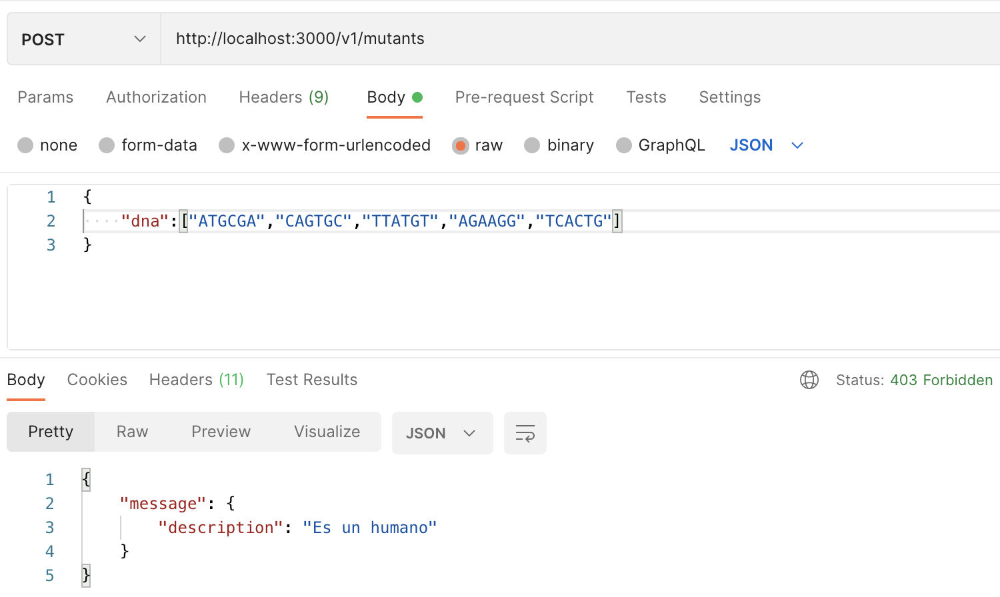
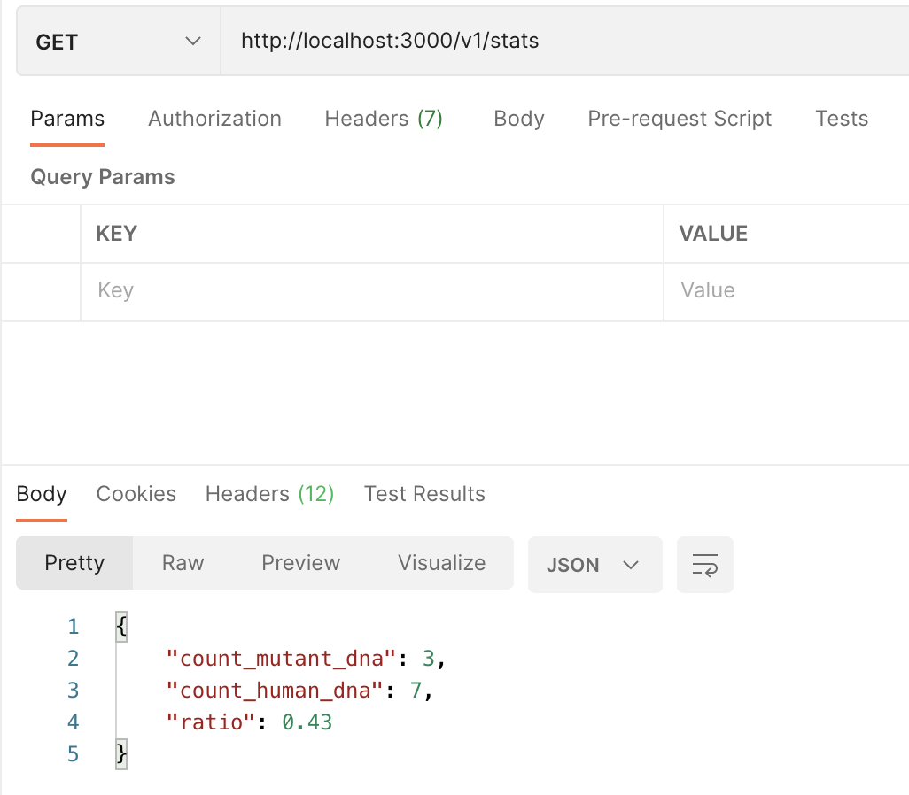

# README

This service is responsible for analyze the dna a subject and determined if a mutant or human.

## Main branch

```bash
  git checkout master
```

## Setup

Just run the setup script to configure the app:

```bash
  bundle/install
```

To configure the connection with the database you must modify the environment variables in the file `.env`

```bash
  bin/setup
```


Now you should be able to run the tests:

```bash
  bin/rspec
```

Run the the app:

```bash
  bin/rails server
```

## Endpoints avaliables

### Analyze subjects

Method: POST

```json
/v1/mutants
```

#### Mutant



#### Human



### Stats

Method: GET

```json
/v1/stats
```

#### Stats



## Environment dependencies

* Ruby version **2.7.1**
* Postgresql
